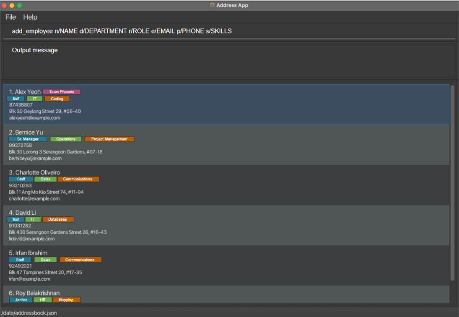

Team T08-3's Team Repo

# Slackbook

Slackbook is a desktop application designed to empower HR professionals by streamlining employee directory management in one intuitive and centralized space.
It minimizes time wasted searching across platforms, ensures records stay accurate, and supports smoother communication and collaboration within organizations.
With Slackbook, HR teams can focus less on administrative overhead and more on what really matters—people.

# Why Slackbook?

- Save time searching across multiple systems
- Keep employee data accurate and up-to-date
- Foster collaboration through centralized, reliable information
- Reduce administrative overhead with an intuitive HR-focused tool

# Key Features

## Employee Information Management

Add, edit, and update employee details such as name, contact information, role, department, and skills.

## Organization & Categorization

Tag employees with departments, teams, and roles. Assign multiple categories to one employee (e.g., Engineering + Project Lead).

## Data Quality & Integrity

Visual alerts highlight missing or outdated data to help ensure record accuracy.

## Employee Directory

Browse all employees in a searchable, scrollable list with quick filters for department, team, or role.

## Persistent Data Retention

Employee data is stored locally in a dedicated file, automatically created and updated with changes.

# About the Project

## Architecture & Design

Slackbook is built following object-oriented programming (OOP) principles, ensuring modular, maintainable, and extensible code.

## Documentation

Slackbook comes with a reasonable set of user and developer documentation, making it approachable for both end-users and contributors.

## Project Origin

This project is inspired by and adapted from the AddressBook-Level3 project created by the [SE-EDU initiative](https://se-education.org), extending the core idea into a specialized HR directory tool.
